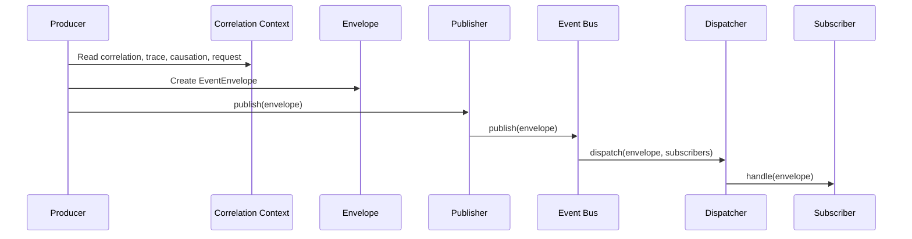
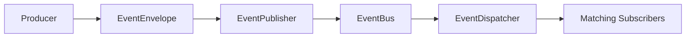
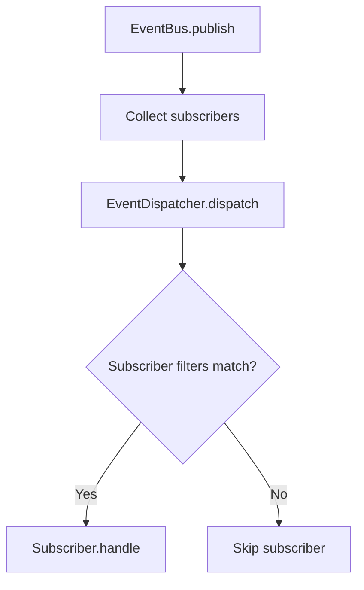
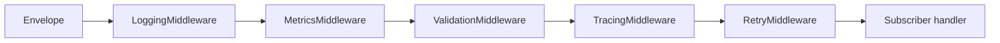
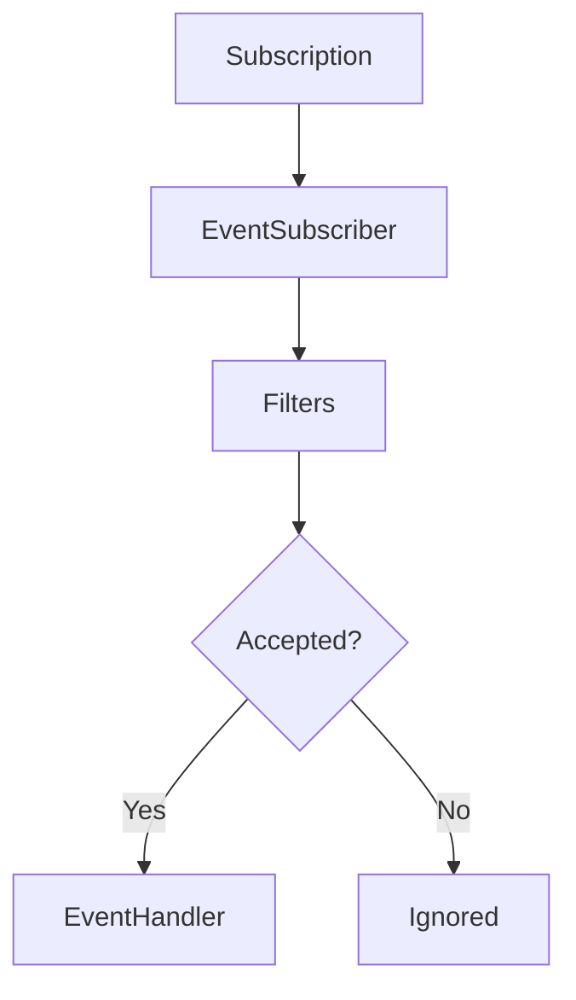
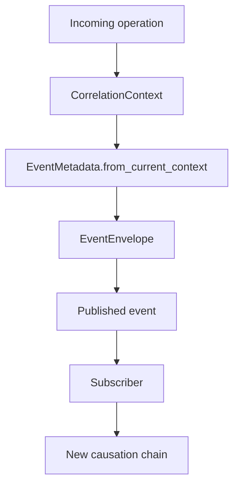

# Event Model

The Horizon Event Platform defines how events exist and move inside the platform. It is not an Event Store, broker, queue, database, or infrastructure decision.

The platform is intentionally technology-agnostic. Event persistence, broker selection, stream storage, and replay infrastructure must be defined by future RFCs and ADRs before implementation.

## Event Life Cycle

An event starts as a domain occurrence represented by primitive event data. Before it moves through the platform, it is wrapped in an `EventEnvelope` containing metadata, headers, trace context, correlation, causation, tenant information, and version fields.

## Envelope

`EventEnvelope` is the transport shape used inside the platform.

It contains:

- `event`
- `metadata`
- `headers`
- `trace`
- `correlation`
- `causation`
- `tenant`
- `version`
- `schema_version`

The envelope is immutable after creation. Consumers receive event data and context without being able to mutate the original event in transit.

## Metadata

`EventMetadata` describes event identity, origin, time, and traceability.

It contains:

- `EventId`
- `AggregateId`
- `CorrelationId`
- `CausationId`
- `OccurredAt`
- `CreatedAt`
- `Producer`
- `Source`
- optional `UserId`
- `TraceId`
- `SpanId`
- `RequestId`
- `Environment`
- `Tags`

## Publication Flow

## Dispatch Flow

## Pipeline

Middleware wraps dispatch without introducing infrastructure coupling.

## Subscriber Flow

## Correlation And Causation

Correlation is propagated with `ContextVars`, not global mutable state. The active context carries:

- `CorrelationId`
- `TraceId`
- `CausationId`
- `RequestId`

`CorrelationId` groups related work.
`CausationId` identifies the immediate cause of an event.
`TraceId` and `SpanId` support distributed tracing without choosing a tracing vendor.
`RequestId` connects events to the initiating request or command when one exists.

## Versioning

Every envelope carries:

- `event_version`
- `schema_version`

The current implementation models compatibility relationships without performing automatic migrations:

- Same version: compatible.
- Higher local version: backward compatible.
- Lower local version: forward-only.

Migration, upcasting, downcasting, and schema registry storage are future decisions and require RFCs or ADRs.

## Serialization

The platform defines an `EventSerializer` contract and provides `DictionarySerializer`.

`DictionarySerializer` converts envelopes to primitive dictionaries and restores them from dictionaries. It intentionally does not depend on JSON. JSON, MessagePack, Avro, and Protobuf adapters can be added later behind the same contract.

## Boundaries

The following are contracts only:

- `EventStore`
- `EventStream`
- `SnapshotStore`
- `DeadLetterPublisher`
- `DeadLetterStore`

No persistence or broker behavior is implemented in this module.
