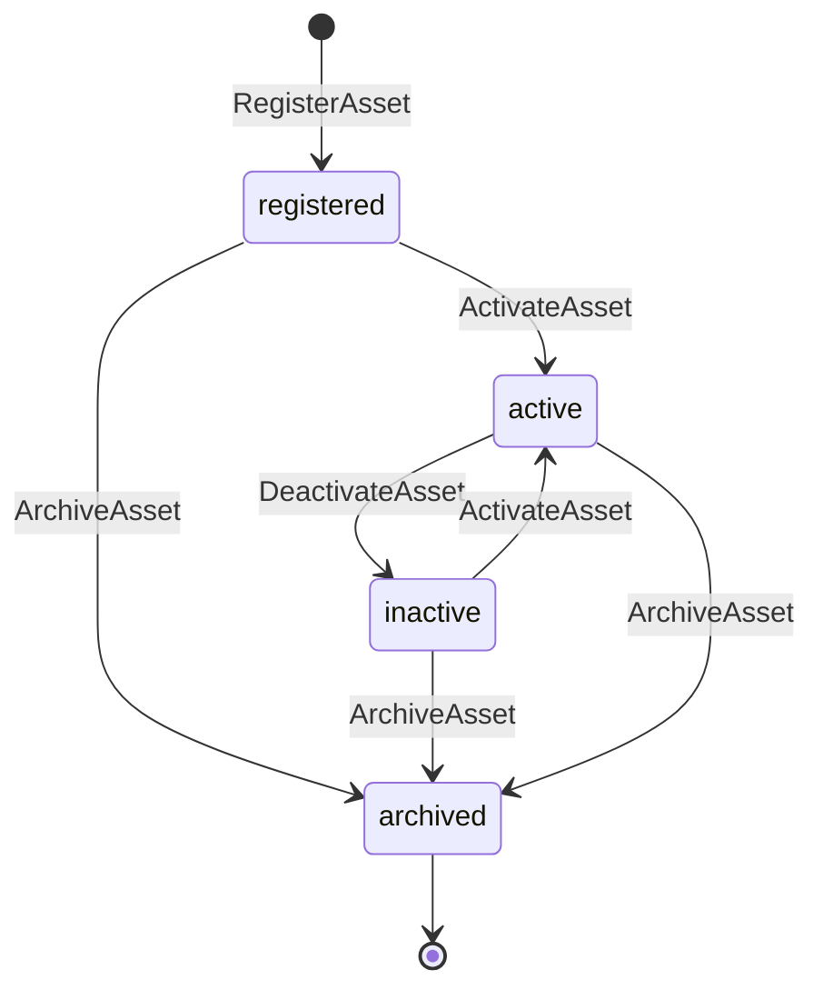
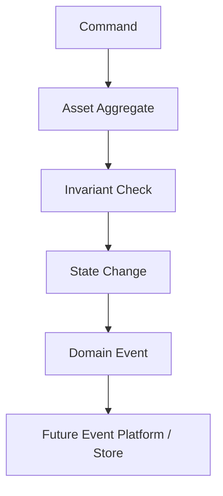

# SPEC-0001: Asset

Status: Accepted

## Objective

Define `Asset` as the universal root aggregate for Horizon. An Asset is any connected or managed thing that can be identified, owned, classified, configured, activated, deactivated, archived, and referenced by other domains.

This specification deliberately avoids vehicle-specific behavior. Vehicle, telemetry, GPS, fuel, RPM, temperature, engine, tire, and sensor concepts belong to future domains.

## Responsibilities

- Preserve stable Asset identity.
- Represent generic Asset classification.
- Represent ownership.
- Represent lifecycle status.
- Accept generic configuration.
- Emit a domain event for every important lifecycle or ownership/configuration change.
- Provide the root reference that future aggregates depend on.

## Possible States

- `registered`: the Asset exists but is not active.
- `active`: the Asset is enabled for platform use.
- `inactive`: the Asset is intentionally disabled but still available for future activation.
- `archived`: the Asset is retained for history and cannot be activated again.

## Transitions

| From | Command | To | Event |
| --- | --- | --- | --- |
| none | `RegisterAsset` | `registered` | `AssetRegistered` |
| `registered` | `ActivateAsset` | `active` | `AssetActivated` |
| `inactive` | `ActivateAsset` | `active` | `AssetActivated` |
| `active` | `DeactivateAsset` | `inactive` | `AssetDeactivated` |
| `registered` | `ArchiveAsset` | `archived` | `AssetArchived` |
| `inactive` | `ArchiveAsset` | `archived` | `AssetArchived` |
| `active` | `ArchiveAsset` | `archived` | `AssetArchived` |
| any non-archived | `TransferOwnership` | unchanged | `AssetTransferred` |
| any non-archived | `UpdateConfiguration` | unchanged | `AssetConfigurationChanged` |

## Produced Events

- `AssetRegistered`
- `AssetActivated`
- `AssetDeactivated`
- `AssetArchived`
- `AssetTransferred`
- `AssetConfigurationChanged`

## Consumed Events

This sprint does not implement event consumption or rehydration. Event replay and projection rules require a future Event Store decision.

## Invariants

- Asset cannot exist without identity.
- Asset ID never changes after registration.
- Asset is never removed.
- Archived Asset cannot be activated.
- Archived Asset cannot transfer ownership.
- Archived Asset cannot change configuration.
- Every important change records a domain event.
- Asset cannot contain vehicle, telemetry, GPS, fuel, RPM, temperature, engine, tire, or sensor concepts.

## Lifecycle Flow



## Event Flow



## Examples

Registering an Asset:

```text
RegisterAsset(
  identity=AssetIdentity(name="Trailer 4821", external_reference="fleet-4821"),
  classification=AssetClassification(category="logistics.asset", kind="trailer"),
  ownership=Ownership(owner_id="tenant-a")
)
```

Activating an Asset:

```text
ActivateAsset(asset_id=<asset-id>)
```

Archiving an Asset:

```text
ArchiveAsset(asset_id=<asset-id>, reason="retired")
```
