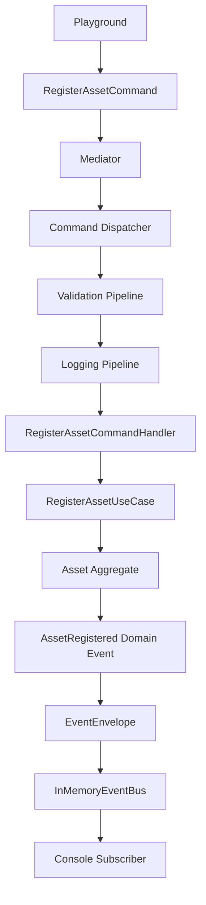
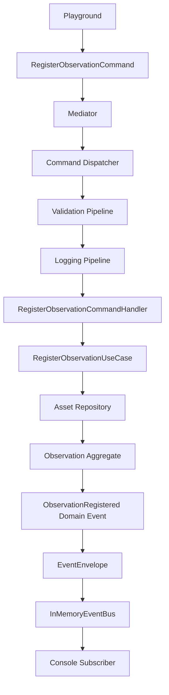

# SPEC-0002: Application Layer

Status: Accepted

## Responsibilities

The Horizon Application Layer coordinates use cases without introducing infrastructure. It accepts application commands and queries, executes pipelines, delegates to use cases and domain aggregates, maps domain events to event envelopes, and publishes them through the in-memory Event Bus.

It must not depend on FastAPI, databases, Redis, Docker, HTTP, ORM tools, Collector, Digital Twin, Knowledge, Journey, or Observation behavior.

## Flow



## Mediator

The mediator is the application entrypoint. It routes commands to the command dispatcher and queries to the query dispatcher. It does not contain domain logic.

## Pipelines

- Validation Pipeline ensures requests are non-null and invokes a request `validate()` method when present.
- Logging Pipeline records before/after messages around handler execution.

Pipelines are in-process decorators around command/query handling. They do not write to files, logs, databases, or external systems.

## Register Asset Use Case

The first vertical slice supports `RegisterAssetCommand`.

The use case:

1. Maps application input to Asset domain value objects.
2. Calls `Asset.register`.
3. Saves the aggregate in an in-memory repository.
4. Maps produced Domain Events to Event Envelopes.
5. Publishes envelopes through the in-memory Event Bus.
6. Returns a DTO containing the aggregate and produced envelopes.

## Register Observation Use Case

Sprint-007 extends the in-memory application layer with `RegisterObservationCommand`.

The use case:

1. Receives an Asset ID and observation data from the playground.
2. Confirms the Asset exists in the in-memory Asset repository.
3. Maps input to Observation domain value objects.
4. Calls `Observation.register`.
5. Saves the Observation in an in-memory repository.
6. Maps produced Domain Events to Event Envelopes.
7. Publishes envelopes through the in-memory Event Bus.
8. Returns a DTO containing the Observation and produced envelopes.



## Playground

`apps/playground/main.py` provides a terminal menu:

```text
===================================
HORIZON PLAYGROUND
1 Register Asset
2 Register Observation
3 List Assets
4 List Observations
5 Show Domain Events
6 Exit
===================================
```

The playground is an in-memory adapter for local exploration only.
