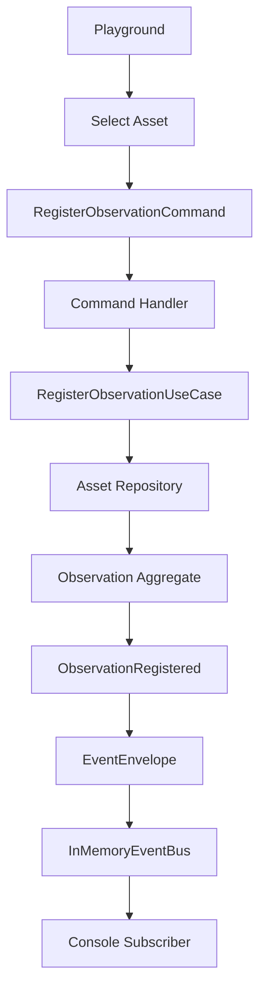
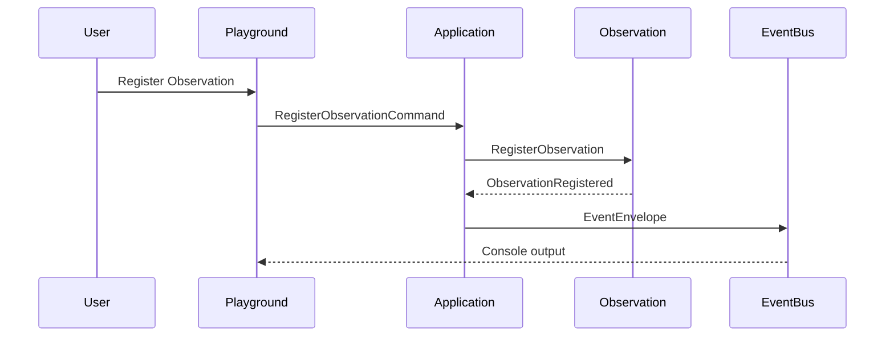
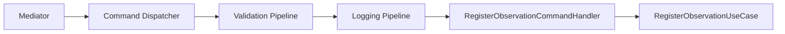

# SPEC-0003: Observation

Status: Accepted

## Objective

Define Observation as a factual measurement recorded for an Asset at a specific instant.

Observation represents a fact. It does not represent knowledge, insight, recommendation, telemetry consolidation, Digital Twin state, or Collector behavior.

## Responsibilities

- Reference an existing Asset.
- Capture observation type, value, unit, source, timestamp, and quality.
- Validate measurement shape.
- Emit `ObservationRegistered`.
- Support the in-memory playground vertical slice.

## Value Objects

- `ObservationId`
- `ObservationType`
- `ObservationValue`
- `ObservationUnit`
- `ObservationSource`
- `ObservationTimestamp`
- `ObservationQuality`

## Command

- `RegisterObservation`

## Event

- `ObservationRegistered`

## Invariants

- Observation must reference an Asset.
- Type must be known.
- Value must be finite.
- Unit cannot be blank.
- Source cannot be blank.
- Timestamp must be timezone-aware.
- Timestamp cannot be in the future.

## Flow

## Events

## Application Layer

