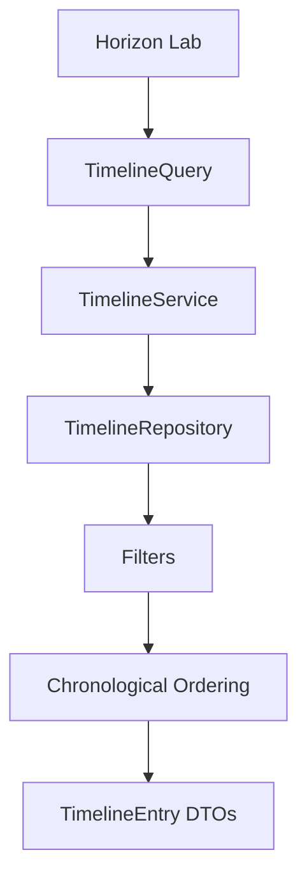
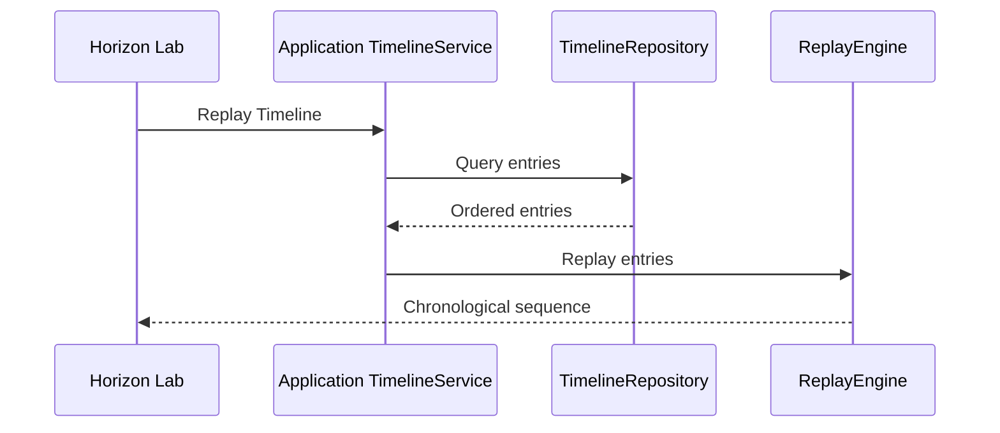

# SPEC-0004: Temporal Memory

Status: Accepted

## Objective

Define the in-memory Temporal Memory Engine that provides the official chronological Timeline for Asset Observations.

This specification does not define Digital Twin state, Knowledge, Insights, Recommendations, Collector behavior, APIs, databases, or physical persistence.

## Responsibilities

- Add registered Observations to an Asset Timeline.
- Store Timeline entries in memory.
- Query entries chronologically.
- Filter by Asset, Observation type, and period.
- Replay entries deterministically.
- Navigate around timestamps through a Timeline cursor.

## Components

- `Timeline`
- `TimelineEntry`
- `TimelineCursor`
- `ReplayEngine`
- `TimelineQuery`
- `TimelineService`
- `TimelineRepository`
- `InMemoryTimelineRepository`

## Invariants

- Timeline entries must reference an Asset.
- Timeline entries must reference an Observation.
- Timeline entries must have a timezone-aware timestamp.
- Timeline entries are immutable.
- Timeline query results are ordered chronologically.
- Timeline does not infer meaning or mutate Digital Twin state.

## Query Flow



## Replay Flow



## Horizon Lab

Horizon Lab is the official in-memory local laboratory for this sprint and is executed with:

```bash
python apps/horizon-lab/main.py
```

```text
====================================
HORIZON LAB
1 Register Asset
2 Register Observation
3 Show Timeline
4 Replay Timeline
5 List Events
6 Exit
====================================
```

## Examples

Registering an Observation creates both an `ObservationRegistered` event and an in-memory `TimelineEntry` for the referenced Asset.

Replay returns entries sorted by timestamp:

```text
2026-01-01T10:00:00+00:00 temperature=23.5 celsius
2026-01-01T10:05:00+00:00 rpm=900 rpm
```
