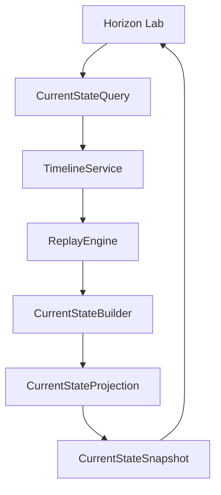

# SPEC-0005: Current State Engine

Status: Accepted

## Objective

Define the in-memory Current State Engine that builds the present state of an Asset from Timeline replay.

This specification does not define Living Digital Twin behavior, Knowledge, AI, Health Score, recommendations, Collector behavior, APIs, databases, or physical persistence.

## Responsibilities

- Query Timeline for an Asset.
- Replay Timeline entries chronologically.
- Keep the latest Observation for each type.
- Produce an immutable `CurrentStateSnapshot`.
- Expose the result through Horizon Lab.

## Components

- `CurrentState`
- `CurrentStateBuilder`
- `CurrentStateProjection`
- `CurrentStateSnapshot`
- `CurrentStateQuery`
- `CurrentStateService`

## Invariants

- Current State requires an Asset ID.
- Current State is derived only from Timeline entries.
- Timeline entries are never mutated.
- Latest value per type is determined by timestamp and sequence.
- Snapshots are immutable.
- Empty Timelines produce an empty Current State.

## Flow



## Example

Timeline:

```text
08:10 RPM = 900
08:11 RPM = 2400
08:12 RPM = 1100
08:13 Coolant = 91 celsius
08:14 Battery = 14.18 volt
```

Current State:

```text
RPM = 1100
Coolant = 91 celsius
Battery = 14.18 volt
```

## Horizon Lab

```text
====================================
HORIZON LAB
1 Register Asset
2 Register Observation
3 Show Timeline
4 Replay Timeline
5 Show Current State
6 List Events
7 Exit
====================================
```
