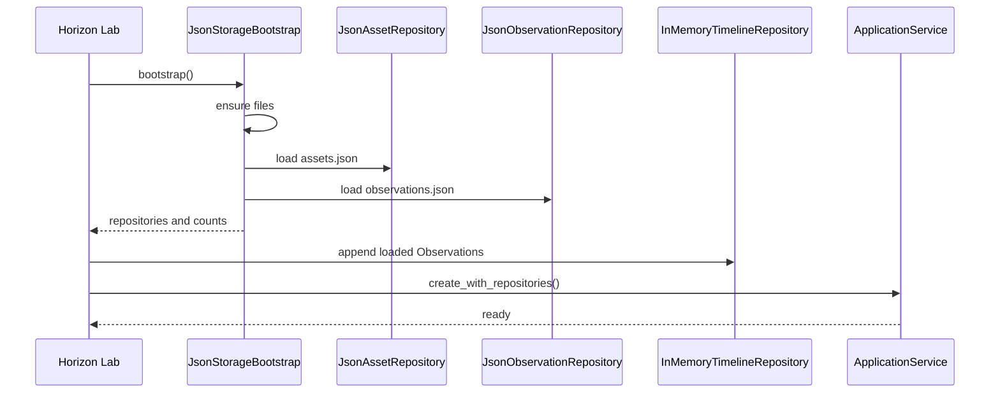

# SPEC-0006: Persistence Layer

Status: Accepted

## Objective

Define the first Horizon persistence layer as a JSON adapter that stores only source facts and reconstructs in-memory projections on startup.

This specification does not define databases, ORM tools, physical infrastructure services, Event Store semantics, Digital Twin behavior, Knowledge, AI, Collector behavior, FastAPI, Redis, Docker, or API persistence.

## Responsibilities

- Create storage files when absent.
- Save and load Assets.
- Save and load Observations.
- Maintain storage metadata.
- Rebuild Timeline from loaded Observations.
- Leave Current State as a derived query over Timeline.
- Keep domain packages independent from JSON.

## Storage Layout

```text
storage/
  assets.json
  observations.json
  metadata.json
```

`metadata.json` starts with:

```json
{
  "storage_version": 1,
  "created_at": "",
  "last_update": ""
}
```

Runtime bootstrap populates timestamps when files are auto-created.

## Components

- `StorageAdapter`
- `StorageSerializer`
- `StorageBootstrap`
- `JsonStorageAdapter`
- `AssetSerializer`
- `ObservationSerializer`
- `JsonAssetRepository`
- `JsonObservationRepository`
- `JsonStorageBootstrap`

## Invariants

- Assets are persisted as facts.
- Observations are persisted as facts.
- Timeline is never persisted.
- Current State is never persisted.
- Replay results are never persisted.
- Derived state must be reconstructed from persisted Observations.
- Domain packages must not import `horizon_storage`.

## Bootstrap Flow



## Horizon Lab Startup

```text
====================================
HORIZON LAB
Assets carregados: X
Observations carregadas: Y
Storage:
JSON
====================================
```

## Corruption Handling

Invalid JSON or unexpected top-level shapes raise storage corruption errors. The adapter must not silently drop or rewrite corrupt facts.
