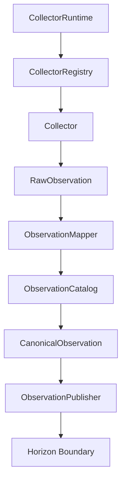
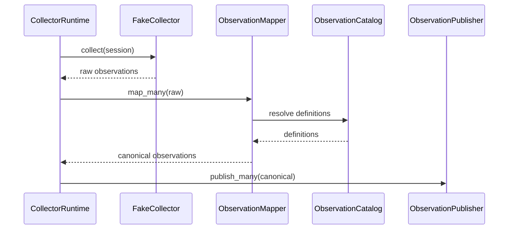

# SPEC-0009: Collector Framework

Status: Accepted

## Objective

Define the generic Collector Framework for ingesting observations from external sources.

The framework must be reusable, transport-agnostic, catalog-driven, and independent from Horizon Core internals.

## Responsibilities

- Receive raw external observations.
- Normalize external observation keys.
- Resolve official Observation Catalog definitions.
- Validate observation values.
- Create Canonical Observations.
- Publish Canonical Observations through a contract.
- Execute collectors through a runtime.
- Register collectors by name.

## Non-Responsibilities

The Collector Framework must not implement:

- OBD.
- Bluetooth.
- CAN.
- MQTT.
- REST.
- CSV.
- Serial.
- TCP.
- UDP.
- Hardware.
- Dashboard.
- API.
- Domain behavior.
- Application use cases.
- Storage.
- Timeline.
- Current State.
- Experience.
- Living Digital Twin.
- Knowledge.
- AI.

## Components

- `RawObservation`: source data received from a collector.
- `CanonicalObservation`: catalog-backed observation ready for publication.
- `Collector`: contract for external sources.
- `CollectorAdapter`: contract for future transport adapters.
- `CollectorSession`: execution context for one collector run.
- `CollectorRuntime`: coordinates collection, mapping, and publishing.
- `ObservationMapper`: maps raw observations to Canonical Observations.
- `CollectorRegistry`: registers and retrieves collectors.
- `ObservationPublisher`: publishes Canonical Observations through a boundary.
- `FakeCollector`: emits deterministic sample observations without hardware.

## Ingestion Flow

## Fake Collector Flow

## Fake Collector Observations

The Fake Collector must emit:

- `engine.rpm`
- `engine.coolant.temperature`
- `electrical.battery.voltage`

The mapper must resolve these into official catalog definitions:

- `engine.rpm`
- `engine.temperature`
- `electrical.battery_voltage`

## Invariants

- Collectors do not import Domain.
- Collectors do not import Application.
- Collectors do not import Storage.
- Collectors do not import Timeline.
- Collectors do not import Current State.
- Collectors do not import Experience.
- Transport details remain outside Horizon Core.
- External keys must be normalized through the Observation Catalog.
- Non-numeric catalog definitions must not be converted into numbers for the current runtime.
- Failed collector runs must mark their sessions as failed.

## Acceptance Criteria

- Registry can register and retrieve collectors.
- Registry rejects duplicate collectors.
- Runtime executes a collector once.
- Runtime maps raw observations to Canonical Observations.
- Runtime publishes Canonical Observations.
- Mapper rejects unknown definitions.
- Mapper rejects unsupported value types for the current runtime.
- Fake Collector emits the required observations.
- Pipeline is tested end to end without hardware.
