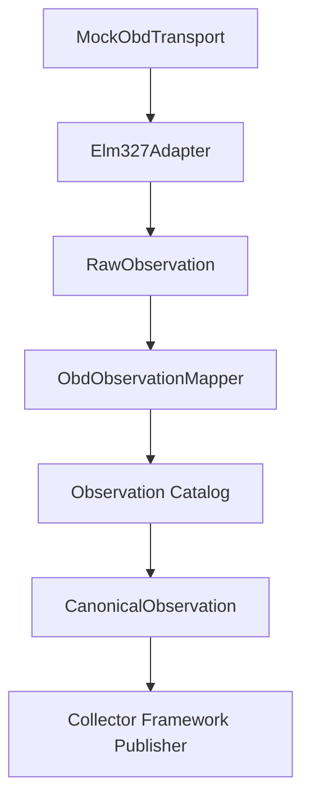
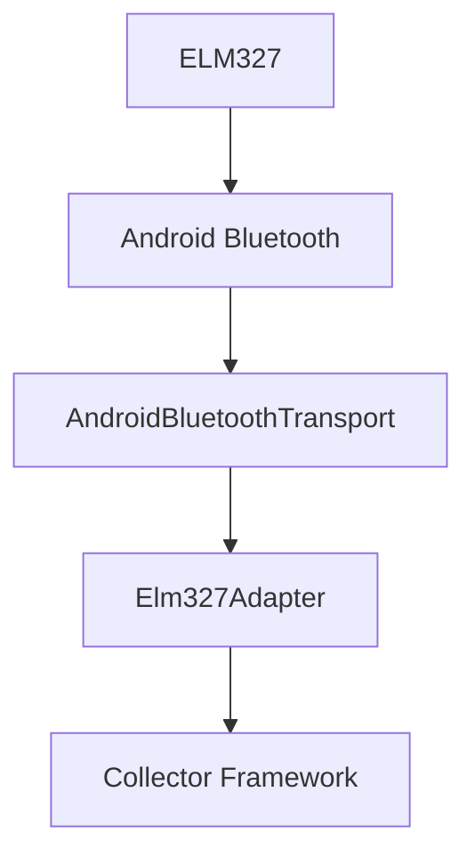

# SPEC-0010: Android OBD Collector

Status: Accepted

## Objective

Define the experimental Android/ELM327 OBD collector adapter.

The adapter reads selected ELM327/OBD values, maps them into the Observation Catalog language, and emits Canonical Observations through the Collector Framework.

## Package

```text
packages/
  collector-obd/
    src/
      collector_obd/
        elm327/
        transport/
        protocol/
        pids/
        mapping/
        android/
        exceptions/
    tests/
```

## Contracts

- `ObdTransport`: connects, closes, and sends OBD commands.
- `ObdCommand`: immutable ELM327 command definition.
- `ObdResponse`: raw command response.
- `ObdPid`: supported PID definition and catalog mapping.
- `ObdSession`: probe/session state.
- `Elm327Adapter`: collector-compatible ELM327 adapter.
- `ObdObservationMapper`: maps OBD raw observations through the Observation Catalog.

## Supported Commands

```text
ATZ
ATE0
ATL0
ATS0
ATH0
ATSP0
010C
0105
0142
```

## PID Mapping

| PID | Meaning | Catalog Definition |
| --- | --- | --- |
| `010C` | RPM | `engine.rpm` |
| `0105` | Coolant Temperature | `engine.temperature` |
| `0142` | Control Module Voltage | `electrical.battery_voltage` |

## Mock Flow



## Android Flow



`AndroidBluetoothTransport` is a placeholder boundary. Real Bluetooth is not implemented until an approved Android runtime exists.

## Invariants

- No Horizon Core package imports `collector_obd`.
- `collector-obd` does not alter Domain.
- `collector-obd` does not alter Application.
- `collector-obd` does not alter Storage.
- `collector-obd` does not alter Timeline.
- `collector-obd` does not alter Current State.
- `collector-obd` does not alter Experience.
- `collector-obd` does not alter Observation Catalog.
- `collector-obd` does not alter Collector Framework.
- No automatic persistence happens in this capability.

## Acceptance Criteria

- Mock transport simulates RPM.
- Mock transport simulates coolant temperature.
- Mock transport simulates battery/control module voltage.
- Values are parsed from ELM327-style responses.
- Values map to Canonical Observations.
- Canonical Observations publish through the Collector Framework.
- Android/Realme setup steps are documented.
- Bluetooth limitations are explicit.
