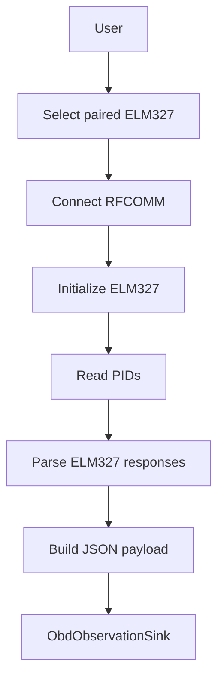

# SPEC-0011: Android OBD Bridge

Status: Accepted

## Objective

Define the minimal Android/Kotlin bridge for reading ELM327 OBD-II data and emitting Horizon-compatible observation payloads.

## Package

```text
apps/
  android-obd-bridge/
    app/
      src/
        main/
          java/com/codesynergy/horizon/obdbridge/
            bluetooth/
            elm327/
            model/
            sink/
            ui/
        test/
```

## Responsibilities

- List paired Bluetooth devices.
- Select an ELM327 adapter.
- Connect using classic Bluetooth RFCOMM.
- Send ELM327 initialization commands.
- Read supported OBD-II PIDs.
- Parse ELM327 responses.
- Convert PID readings into observation payloads.
- Display latest readings.
- Emit JSON through `ObdObservationSink`.

## Non-Responsibilities

- Horizon persistence.
- Horizon API implementation.
- Dashboard.
- Domain logic.
- Collector Framework changes.
- Observation Catalog changes.
- Current State or Timeline updates.
- Living Digital Twin behavior.

## Supported Commands

```text
ATZ
ATE0
ATL0
ATS0
ATH0
ATSP0
010C
0105
0142
```

## PID Mapping

| PID | Formula | Definition | Unit |
| --- | --- | --- | --- |
| `010C` | `((A * 256) + B) / 4` | `engine.rpm` | `rpm` |
| `0105` | `A - 40` | `engine.temperature` | `celsius` |
| `0142` | `((A * 256) + B) / 1000` | `electrical.battery_voltage` | `volt` |

## UI

The first UI is intentionally minimal:

- Device selector.
- Refresh paired devices.
- Connect.
- Start reading.
- Status.
- RPM.
- Temperature.
- Voltage.
- Last reading timestamp.

## Sinks

- `LogcatSink`: emits payload JSON to Android Logcat.
- `HttpSink`: placeholder until a Horizon ingestion endpoint is approved.

## Flow



## Acceptance Criteria

- Android project exists.
- Kotlin source separates Bluetooth, parser, payload, sink, and UI.
- Parser is unit-testable.
- Payload JSON matches RFC-0013.
- UI shows connection status and latest readings.
- Realme test plan is documented.
- No Horizon Core package is changed.
