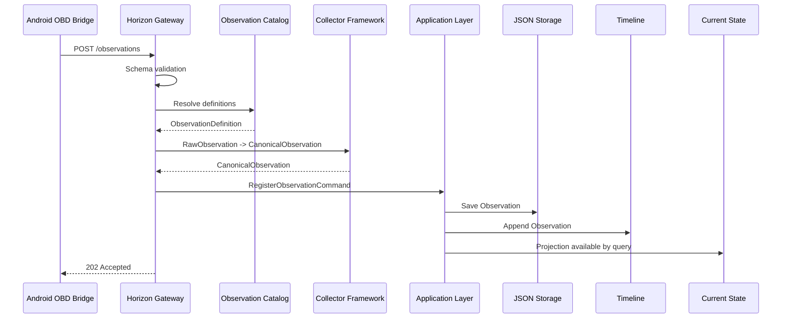

# SPEC-0012: Live Ingestion

Status: Accepted

## Objective

Define the first local live ingestion path for external collector observations.

The implementation receives Android OBD Bridge payloads through `POST /observations` and forwards valid Observations into Horizon's existing Application, Storage, Timeline, and Current State pipeline.

## Package

```text
services/
  horizon-gateway/
    app/
      api/
      schemas/
      validation/
      services/
      dependencies/
      config/
      main.py
    tests/
```

## Responsibilities

- Expose `POST /observations`.
- Validate HTTP payload structure.
- Require source, Asset reference, at least one observation, definition ID, value, unit, timestamp, and quality.
- Require timezone-aware timestamps.
- Validate Observation definitions against the Observation Catalog.
- Validate numeric values using the Catalog value validator.
- Reject unsupported non-numeric definitions.
- Resolve Asset ID or external reference against existing Assets.
- Map payload entries into Collector Framework `RawObservation`.
- Map raw observations into `CanonicalObservation`.
- Publish Canonical Observations through an Application publisher.
- Persist Observations through existing Storage repositories.
- Append Observations to Timeline through existing Application behavior.
- Report Current State summary after ingestion.

## Non-Responsibilities

- Public API design.
- Authentication.
- User management.
- Authorization.
- Dashboard.
- Domain behavior.
- Collector behavior.
- Bluetooth behavior.
- Storage architecture.
- Timeline architecture.
- Current State architecture.
- Knowledge, AI, or Twin Runtime.

## Endpoint

```text
POST /observations
```

The endpoint returns `202 Accepted` when the payload is validated, mapped, and published.

## Response

```json
{
  "status": "accepted",
  "source": "android-obd-elm327",
  "asset_id": "<resolved asset uuid>",
  "accepted": 3,
  "observations": [],
  "event_count": 3,
  "timeline_entries": 3,
  "current_state_values": 3
}
```

## Live Flow



## Validation Rules

- `source` must be non-empty.
- `asset_id` must be non-empty and resolve to an existing Asset ID or existing external reference.
- `observations` must not be empty.
- `definition_id` must exist in the Observation Catalog.
- `unit` must match the catalog definition unit.
- `timestamp` must be timezone-aware.
- `quality` must be compatible with the Observation runtime.
- `value` must be valid for the catalog definition.
- Current runtime accepts only numeric definitions.

## Acceptance Criteria

- Valid Android OBD Bridge payload is accepted.
- Unknown definitions are rejected.
- Unknown Asset references are rejected.
- Unit mismatches are rejected.
- Storage receives new Observations.
- Timeline grows after ingestion.
- Current State reflects latest values.
- Android OBD Bridge can send payloads through `HttpSink`.

