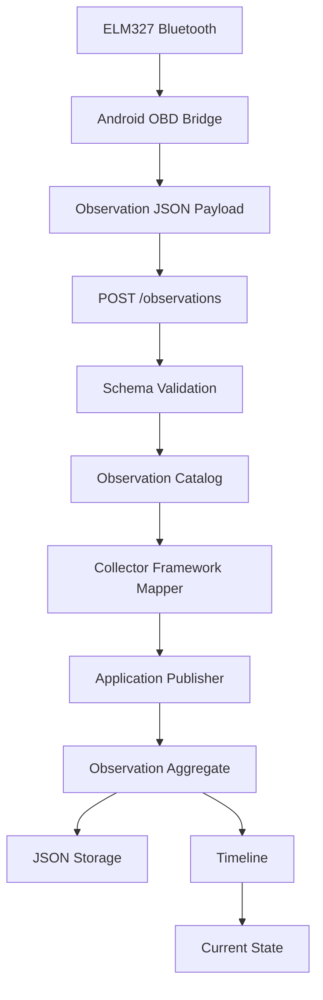

# Capability-009 Live Flow

Status: Draft

## Purpose

Describe the first live ingestion path from Android OBD Bridge into Horizon.

## Flow



## Payload Example

```json
{
  "source": "android-obd-elm327",
  "asset_id": "citroen-c3",
  "observations": [
    {
      "definition_id": "engine.rpm",
      "value": 805,
      "unit": "rpm",
      "timestamp": "2026-06-30T20:00:00Z",
      "quality": "good"
    }
  ]
}
```

## Local Execution

From the Gateway service directory:

```bash
cd services/horizon-gateway
uvicorn app.main:app --reload
```

The Gateway reads local Horizon storage from `storage/` by default.

To use a different storage path:

```bash
HORIZON_GATEWAY_STORAGE_PATH=/tmp/horizon-storage uvicorn app.main:app --reload
```

## Android Configuration

In Android OBD Bridge:

1. Pair the Realme phone with the ELM327 adapter.
2. Open the app.
3. Set Gateway URL, for example `http://192.168.0.10:8000/observations`.
4. Set the Asset ID or external reference.
5. Test Gateway.
6. Connect to ELM327.
7. Start reading.

## Current Limitations

- Asset must already exist in Horizon.
- The Gateway rejects unknown Asset references.
- Current runtime supports numeric Observation definitions only.
- HTTP is local and unauthenticated.
- No public API contract is implied by this capability.

