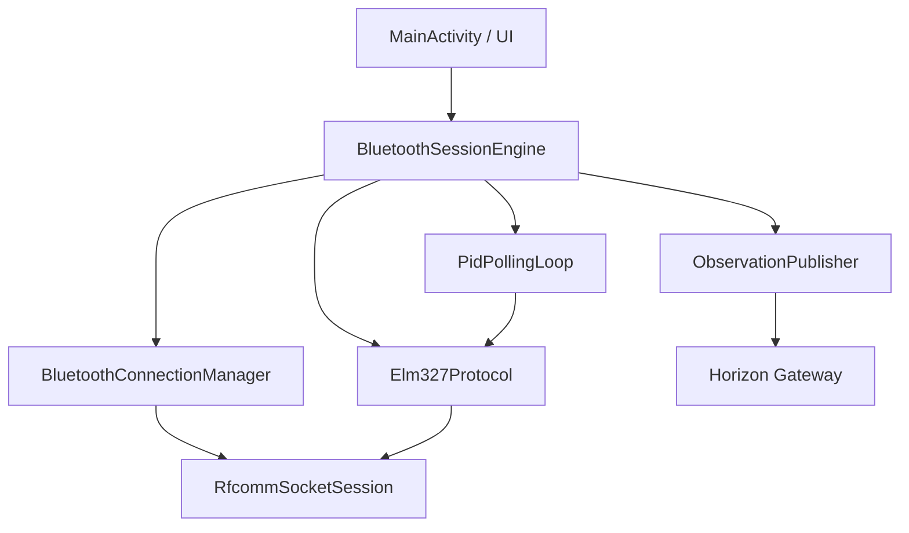

# Bluetooth Session Engine

Status: Draft

## Objective

Stabilize the Horizon Mobile Bluetooth session with ELM327 adapters over classic Bluetooth RFCOMM.

The engine exists only inside Horizon Mobile. It does not alter Horizon Core, Gateway, Domain, Application, Storage, Catalog, Collector Framework, or APIs.

## Architecture

## Session Rules

- One RFCOMM socket is opened per active session.
- The socket is initialized once before reading.
- Commands are serialized through the socket session.
- No PID command is sent before the previous response is read.
- Reconnection always uses the selected MAC address.
- The paired-device list is never refreshed automatically during reading.

## ELM327 Initialization

The engine sends the initialization commands in this order:

1. `ATZ`
2. `ATE0`
3. `ATL0`
4. `ATS0`
5. `ATH0`
6. `ATSP0`

Each command must produce a non-empty response and must not return `?`, `ERROR`, or `NO DATA`.

## Polling Loop

While the session is in `READING`, one cycle sends:

1. `010C` for RPM.
2. `0105` for coolant temperature.
3. `0142` for control module voltage.

The readings are converted to canonical observation payloads before publication.

## States

- `DISCONNECTED`
- `CONNECTING`
- `INITIALIZING`
- `CONNECTED`
- `READING`
- `RECONNECTING`
- `STOPPING`
- `ERROR`

## Reconnection

On read failure or timeout:

1. The current socket is closed.
2. State changes to `RECONNECTING`.
3. The engine reconnects to the same stored MAC address.
4. Backoff delays are `1s`, `2s`, `5s`, and `10s`.
5. If reconnection succeeds, state returns to `READING`.
6. If reconnection fails, state becomes `ERROR`.

## Logging

Logcat uses tag `HorizonBluetooth`.

Expected log families:

- `[Bluetooth] connect requested`
- `[Bluetooth] socket opened`
- `[ELM327] sending ...`
- `[ELM327] response ...`
- `[ELM327] initialized`
- `[OBD] sending ...`
- `[OBD] response ...`
- `[Gateway] POST /observations`
- `[Gateway] response ...`
- `[Bluetooth] read timeout ...`
- `[Bluetooth] reconnecting same MAC ...`

## Boundary

Bluetooth remains an Android concern. Horizon receives canonical observations through the existing Gateway and does not know about ELM327, RFCOMM, Android, or hardware details.
