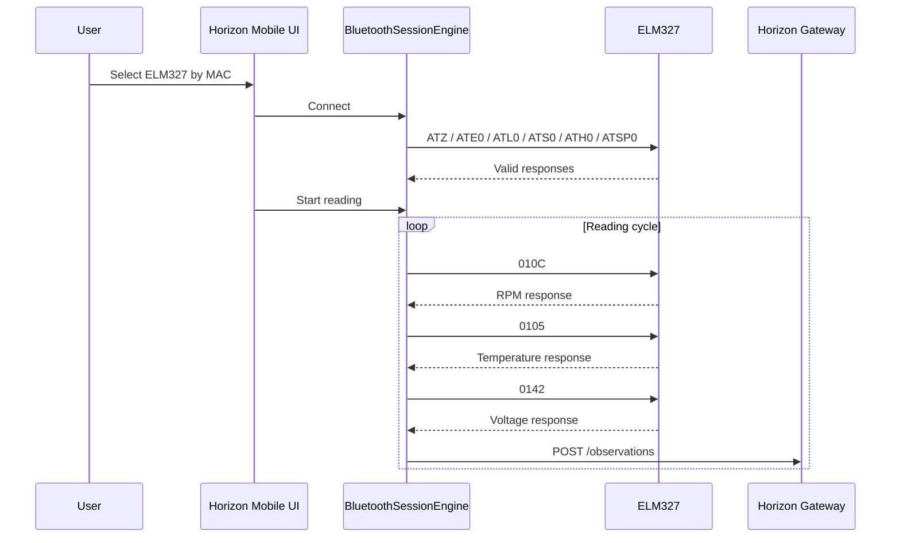

# Capability-012 Result

Status: Draft

## Summary

Capability-012 introduced a Bluetooth Session Engine in Horizon Mobile to stabilize ELM327 RFCOMM communication.

The implementation keeps Bluetooth inside the mobile boundary and preserves the Horizon architecture. The Core, Gateway, Domain, Application, Storage, Catalog, Collector Framework, and APIs were not changed.

## Implemented

- `BluetoothSessionEngine`
- `BluetoothConnectionManager`
- `RfcommSocketSession`
- `Elm327Protocol`
- `PidPollingLoop`
- `ObservationPublisher`
- Logcat logger with tag `HorizonBluetooth`
- Explicit session states
- Same-MAC reconnection
- Backoff reconnection
- UI connection diagnostics
- Unit tests for the new engine

## Session Flow

## Validation

- `./gradlew testDebugUnitTest`: Passed.
- `./gradlew assembleDebug`: Passed.

## APK

Generated at:

`apps/horizon-mobile/app/build/outputs/apk/debug/app-debug.apk`

## Notes

The engine treats Bluetooth read failures separately from Gateway publication failures. A Gateway error does not force a Bluetooth reconnect.
