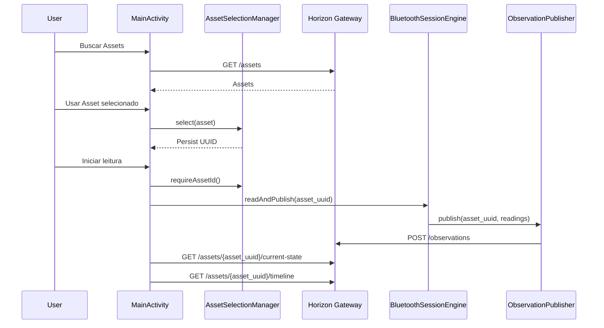

# Mobile Asset Binding

Status: Draft

## Problem

During the C3 field test, Horizon Mobile listed assets successfully but later called:

- `GET /assets/null/current-state`
- `GET /assets/null/timeline`

It also sent observations that the Gateway rejected with `422 Unprocessable Entity`.

Manual Gateway validation with the UUID `3662b190-0a62-4e76-829f-86d500d4552c` returned `202 Accepted`, confirming the issue was mobile application state, not Gateway behavior.

## Decision

Horizon Mobile now has one official selected Asset state.

`AssetSelectionManager` owns:

- current Asset UUID;
- Asset name;
- external reference;
- local persistence;
- restoration on app start;
- validation before live collection.

## Flow

## Rules

- Asset selection always stores UUID.
- Current State always uses UUID.
- Timeline always uses UUID.
- Observation payloads always use UUID.
- Collection is blocked if no UUID is selected.
- Legacy text references are not used for live calls.

## Logs

Expected Logcat messages:

- `[Asset] Asset restored ...`
- `[Asset] Asset selected ...`
- `[Asset] Asset changed ...`
- `[Asset] Asset UUID ...`
- `[Gateway] POST asset_id=...`
- `[Gateway] GET current-state asset_id=...`
- `[Gateway] GET timeline asset_id=...`
