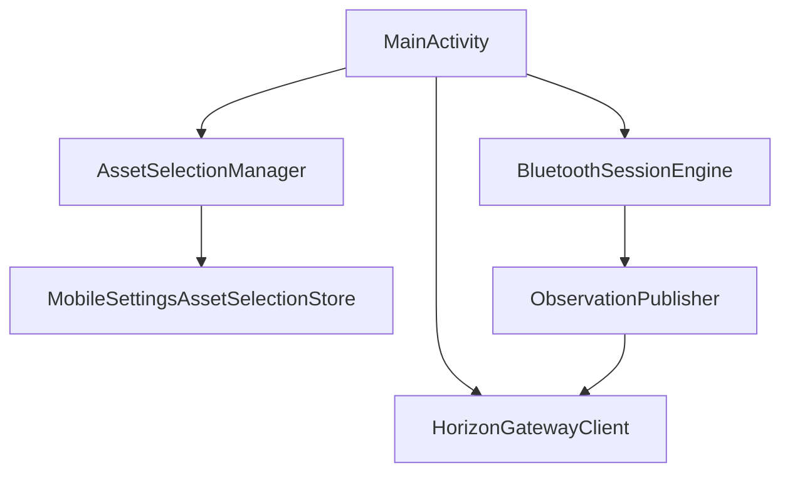

# Capability-013 Review

Status: Draft

## Scope Review

Allowed scope:

- `apps/horizon-mobile/`
- `engineering/capability-013/`

No functional code outside Horizon Mobile was changed.

## Architecture Review

`AssetSelectionManager` becomes the single owner of the selected Asset in the mobile application.

## Boundary Review

The change is purely client-side state management.

The Gateway remains unchanged. Horizon Core remains unchanged. Bluetooth session behavior remains unchanged.

## Tests Added

- Asset selection by UUID.
- Asset persistence.
- Asset restoration.
- Asset switching.
- Blocking without selected Asset.
- POST payload uses UUID.
- Current State URL uses UUID.
- Timeline URL uses UUID.

## Risks

- Existing installations with only the legacy `assetReference` field will need the user to select an Asset once.
- If Gateway returns assets without UUIDs, Horizon Mobile blocks selection.
- Horizon Mobile still has no multi-Asset background sync.
