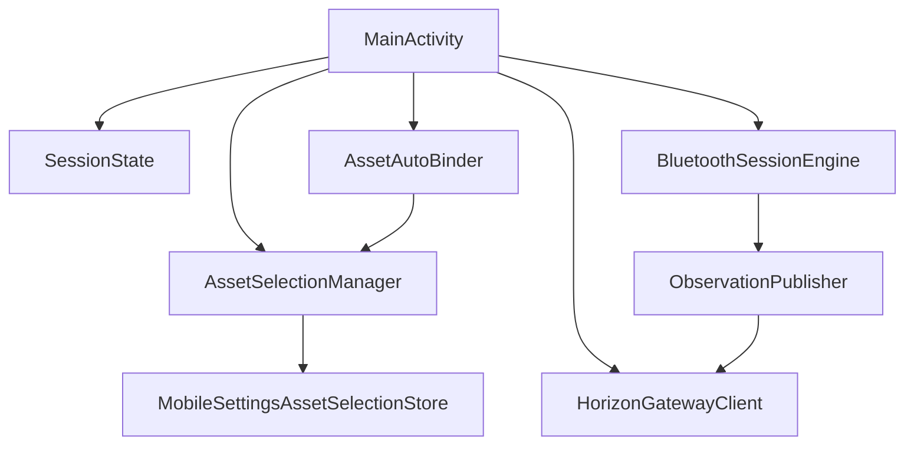

# Capability-013 Review

Status: Draft

## Scope Review

Allowed scope:

- `apps/horizon-mobile/`
- `engineering/capability-013/`

No functional code outside Horizon Mobile was changed.

## Architecture Review

`SessionState` becomes the screen-facing state model, while `AssetSelectionManager` remains the owner of persisted Asset identity.

## Boundary Review

The change is purely client-side state management.

The Gateway remains unchanged. Horizon Core remains unchanged. Bluetooth session behavior remains unchanged.

## Tests Added

- Asset selection by UUID.
- Asset persistence.
- Asset restoration.
- Asset switching.
- SessionState initial state.
- Auto-selection with exactly one Asset.
- No auto-selection with multiple Assets.
- Blocking without selected Asset.
- POST payload uses UUID.
- Current State URL uses UUID.
- Timeline URL uses UUID.
- Gateway 422 body/message exposure.

## Risks

- Existing installations with only the legacy `assetReference` field will need the user to select an Asset once.
- If Gateway returns assets without UUIDs, Horizon Mobile blocks selection.
- Horizon Mobile still has no multi-Asset background sync.
- Startup health check is best-effort and depends on the configured Gateway URL.
