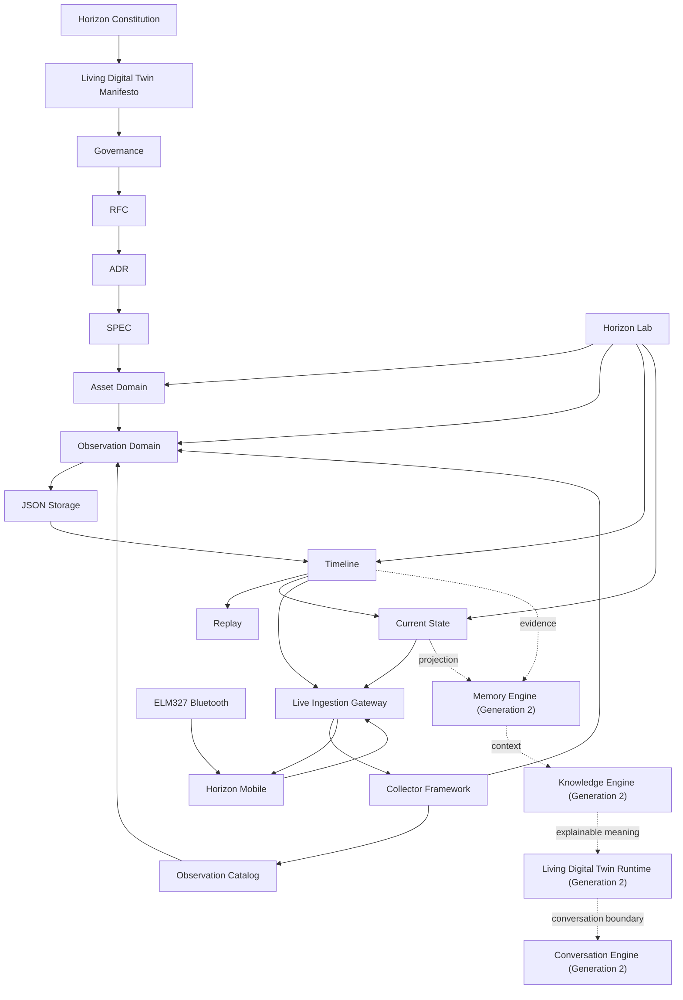

# Horizon Alpha 1.0 Architecture Summary

Status: Prepared for Chief Software Architect review

## Overview

Horizon Alpha 1.0 is organized around a memory-first architecture.

The system begins with Asset identity, receives factual Observations, stores them as evidence, orders them through Timeline, derives Current State, exposes a local Gateway boundary for live ingestion, and presents the state through Horizon Mobile and Horizon Lab.

No Alpha 1.0 component is allowed to treat Observations as knowledge or Current State as intelligence.

## Core

Core responsibilities are split across stable packages:

- `horizon-kernel`: shared primitives and domain-safe foundations.
- `horizon-protocol`: official platform language for messages, headers, identifiers, metadata, naming, registries, and versioning.
- `horizon-events`: event envelopes and in-memory event movement.
- `horizon-domain`: Asset, Observation, Timeline, and Current State domain behavior.

Core does not know Bluetooth, OBD, Android, HTTP clients, dashboards, databases, or AI.

## Application

`horizon-application` coordinates use cases, handlers, dispatchers, repositories, services, and result mapping.

It connects the domain model without becoming infrastructure and without placing business rules in delivery mechanisms.

## Observation Catalog

`horizon-catalog` defines the controlled vocabulary for Observation definitions.

It protects language before facts accumulate. It supports value types beyond the current numeric runtime while preserving the explicit boundary for the future Observation Value Model.

## Storage

`horizon-storage` persists facts locally through JSON adapters.

Storage keeps runtime data durable but does not define domain truth. Timeline and Current State remain rebuildable from stored Observation facts.

## Timeline

Timeline is chronological memory.

It records Observation-derived facts in order, supports filtering, cursor navigation, and replay, and does not interpret meaning.

## Current State

Current State is the latest known projection from Timeline.

It is useful for presentation and queries, but it is not knowledge, diagnosis, intelligence, or the Living Digital Twin.

## Collector

`horizon-collector` is the generic ingestion framework.

It receives external data, normalizes it, resolves catalog definitions, creates Canonical Observations, and publishes them through a boundary. Transport and device concerns stay outside the Core.

## Gateway

`services/horizon-gateway` is the local live ingestion boundary.

It receives `POST /observations`, validates payloads, consults the Observation Catalog, invokes the Collector path, and forwards canonical Observations into the Application pipeline.

It also exposes read-only query composition for Assets, Current State, and Timeline for Horizon Mobile.

## Horizon Mobile

`apps/horizon-mobile` is the first official Horizon client.

It connects to ELM327 through Android Bluetooth, sends Observation payloads to the Gateway, and reads Horizon state back from the Gateway. It presents the Asset state, not raw PID machinery.

## Horizon Lab

`apps/horizon-lab` remains the local engineering laboratory.

It supports local interactive registration, catalog-driven Observation input, Timeline, Replay, Current State, and persisted runtime verification.

## Governance And Documentation

The repository contains permanent foundation documents, governance documents, RFCs, ADRs, SPECs, result artifacts, review artifacts, milestones, and release documentation.

Architecture is not defined by code alone. Accepted documents guide implementation and protect Horizon against drift.

## System Diagram

## Boundary Summary

- Domain remains sovereign.
- Presentation does not create business rules.
- Storage persists facts but does not create truth.
- Gateway validates and forwards but does not interpret.
- Android collects and emits payloads but does not know Horizon domain rules.
- AI is not present in Alpha 1.0.
