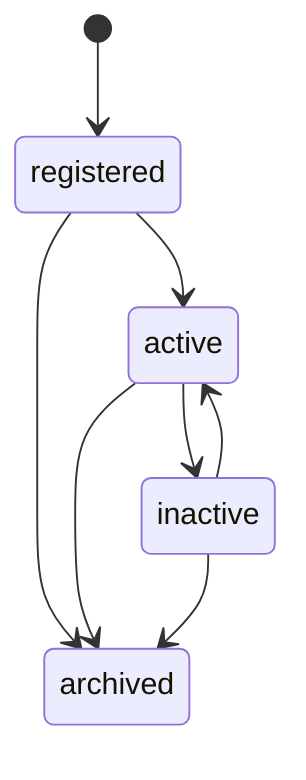

# RFC-0003: Domain Language

Status: Accepted

## Summary

Introduce `Asset` as the first domain concept in Horizon. Asset is the universal aggregate root for any connected or managed thing, independent of vehicle-specific assumptions.

## What Is An Asset?

An Asset is a durable business object that Horizon can identify, own, classify, configure, activate, deactivate, archive, and reference from future domains.

Asset is intentionally broad. It can represent vehicles later, but it can also represent other connected or managed things without changing the core domain language.

## What Is Not An Asset?

An Asset is not:

- A vehicle.
- A sensor reading.
- A GPS position.
- A motor, tire, fuel tank, battery, RPM value, or temperature.
- A Digital Twin.
- A telemetry stream.
- An AI insight.
- A maintenance plan.

Those concepts belong to future domains that may reference Asset.

## Why Asset Instead Of Vehicle?

`Vehicle` narrows the platform too early. Horizon is a connected-asset intelligence platform, and its root language must support more than automotive use cases. `Asset` preserves long-term flexibility while still allowing a future Vehicle domain to specialize behavior around an Asset reference.

## Lifecycle

## Commands

- `RegisterAsset`
- `ActivateAsset`
- `DeactivateAsset`
- `ArchiveAsset`
- `TransferOwnership`
- `UpdateConfiguration`

## Events

- `AssetRegistered`
- `AssetActivated`
- `AssetDeactivated`
- `AssetArchived`
- `AssetTransferred`
- `AssetConfigurationChanged`

## Invariants

- Asset cannot exist without identity.
- Asset ID is stable and cannot change.
- Asset cannot be removed.
- Archived Asset cannot be activated.
- Archived Asset cannot transfer ownership.
- Archived Asset cannot change configuration.
- Important changes must emit Domain Events.

## Dependent Aggregates

Future aggregates expected to depend on Asset include:

- Digital Twin
- Journey
- Maintenance
- Observation
- Recommendation
- Insight
- Collector Registration

Each dependent aggregate should reference Asset by ID and must not mutate Asset state directly.

## Boundary

Asset belongs in `horizon-domain`. It may depend on `horizon-kernel` and future protocol contracts, but it must not depend on FastAPI, databases, ORM tools, brokers, or infrastructure.
