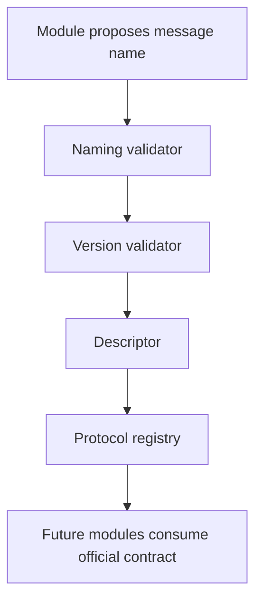
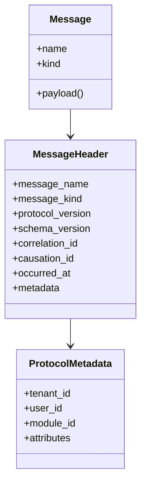

# RFC-0003: Horizon Protocol

Status: Accepted

## Summary

Create `horizon-protocol` as the reusable language specification for Project Horizon.

The package defines how Horizon names, versions, identifies, registers, and references messages across modules. It does not contain business rules, infrastructure, persistence, API behavior, concrete events, Digital Twin behavior, Knowledge Engine behavior, or collector behavior.

## Context

The Engineering Playbook states that communication must happen through contracts, events are traceable, and domain concepts must not be shaped by infrastructure. Before modules can evolve independently, the platform needs a small official protocol that standardizes message names, identifiers, headers, versioning, metadata, and registries.

`RFC-0002` is already assigned to Horizon Event Platform, so this protocol RFC is recorded as `RFC-0003` to preserve accepted repository history.

## Goals

- Provide the official Horizon naming convention.
- Define reusable command, query, domain-event reference, message, header, metadata, envelope, aggregate, entity, correlation, protocol-version, and schema-version contracts.
- Provide immutable identifier types for platform-wide references.
- Provide registries for commands, queries, events, schemas, identifiers, and categories.
- Provide validators for protocol version, schema version, message naming, identifier naming, identifier format, and category naming.
- Define compatibility semantics for protocol and schema evolution.
- Keep the package independent from frameworks, databases, brokers, APIs, product modules, and infrastructure.

## Non-Goals

- Implement concrete business commands, queries, or events.
- Implement Digital Twin, Knowledge Engine, collectors, OBD, API endpoints, or business rules.
- Implement persistence, brokers, schema registry storage, or runtime infrastructure.
- Replace `horizon-events`; the protocol defines language and references, while the event platform defines event movement.

## Package Layout

```text
packages/horizon-protocol/
  src/horizon_protocol/
    commands/
    queries/
    events/
    schemas/
    naming/
    validators/
    registry/
    contracts/
    identifiers/
    versioning/
    shared/
  tests/
```

## Naming Convention

Protocol names use PascalCase.

Commands start with approved imperative verbs:

- `CreateAsset`
- `RegisterMaintenance`
- `StartJourney`
- `FinishJourney`

Queries start with approved read verbs:

- `GetAsset`
- `ListJourneys`
- `FindInsights`

Events use past-tense suffixes:

- `JourneyStarted`
- `JourneyFinished`
- `InsightGenerated`
- `MaintenanceScheduled`

Identifiers use PascalCase and end with `Id`, such as `AssetId`, `JourneyId`, and `CorrelationId`.

Categories use lowercase dotted or kebab format, such as `asset`, `journey.lifecycle`, or `maintenance-planning`.

## Versioning

Protocol and schema versions use semantic versioning:

```text
major.minor.patch
```

Compatibility rules:

- Same version is identical.
- Same major with a higher version is backward-compatible.
- Same major with a lower version is future-compatible.
- Different major versions are incompatible.

## Schema Evolution

Schema evolution must preserve meaning. Compatible changes may add optional fields, add metadata, or widen accepted values without changing existing field semantics.

Incompatible changes require a major version increase and a new registry entry.

## Registry Flow



## Message Shape



## Constraints

- Python 3.13.
- Standard library only.
- Full typing.
- No external dependencies.
- No framework, database, broker, API, product, infrastructure, or domain behavior.

## Validation

The package must maintain at least 95% test coverage and pass Ruff, Black, MyPy, and Pytest.
