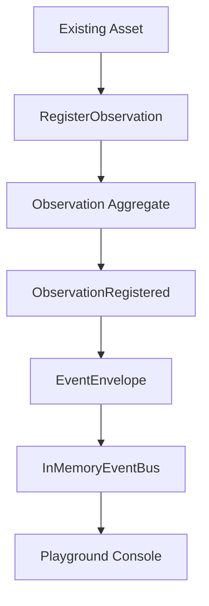

# RFC-0005: Observation Domain

Status: Accepted

## Summary

Introduce `Observation` as the domain aggregate that records one factual measurement made about an Asset at a specific instant.

## What Is An Observation?

An Observation is a fact observed about an Asset. It has an Asset reference, type, value, unit, timestamp, source, and quality.

Observation is not knowledge. It is not an insight, recommendation, Digital Twin state, or consolidated telemetry stream.

## Goals

- Register one Observation for an existing Asset.
- Validate required measurement fields.
- Reject future timestamps.
- Reject unknown observation types.
- Reject invalid numeric values.
- Emit `ObservationRegistered`.
- Publish the event through the in-memory application flow.

## Non-Goals

- Implement telemetry ingestion.
- Implement Collector behavior.
- Implement Digital Twin state changes.
- Implement Knowledge, Insights, or Recommendations.
- Implement persistence, API, database, Redis, Docker, ORM, or infrastructure.

## Commands

- `RegisterObservation`

## Events

- `ObservationRegistered`

## Invariants

- Observation must reference an Asset.
- Observation must have a known type.
- Observation must have a finite numeric value.
- Observation must have a unit.
- Observation must have a timestamp.
- Observation timestamp cannot be in the future.
- Observation must have a source.

## Flow

