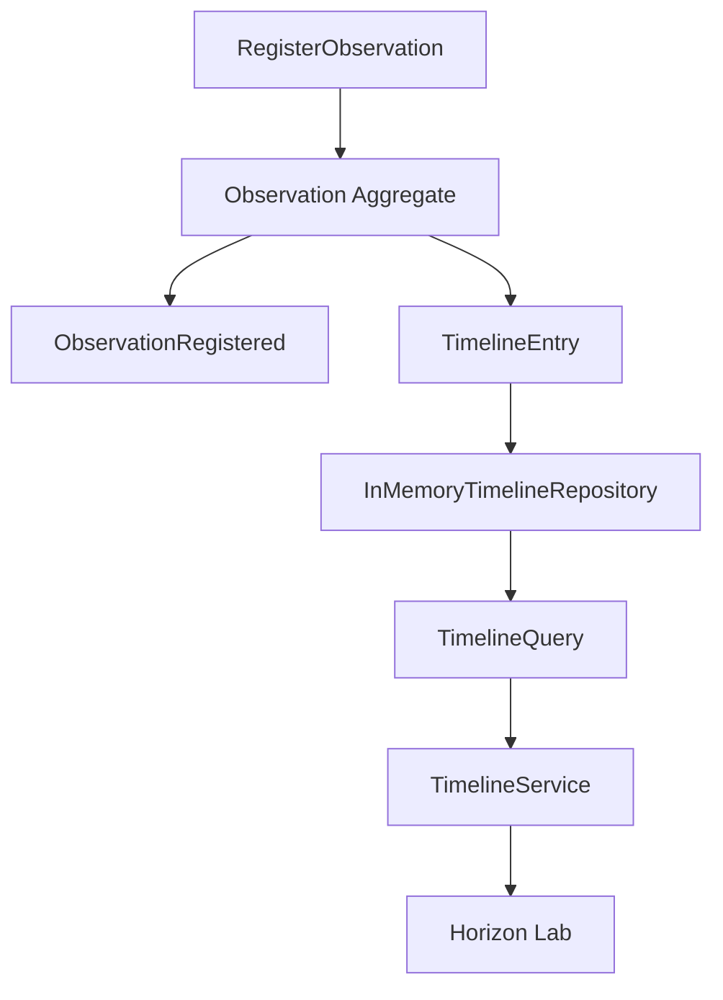

# RFC-0006: Temporal Memory Engine

Status: Accepted

## Summary

Introduce the in-memory Temporal Memory Engine as the official chronological memory for Asset Observations.

The engine provides Timeline storage, querying, filtering, cursors, and replay without implementing Digital Twin, Knowledge, Insights, Collector behavior, physical persistence, APIs, or infrastructure.

## Context

Horizon treats events as truth and state as projection. Sprint-007 introduced Observation as a factual measurement over an Asset. Sprint-008 creates the temporal projection that orders those facts by time so future modules can consume a consistent Asset history.

This RFC deliberately avoids Event Store architecture. The Temporal Memory Engine is an in-memory module that can later be backed by an approved persistence or event-store decision.

## Goals

- Store Observation-derived Timeline entries in memory.
- Query a Timeline chronologically.
- Filter by Asset, Observation type, and period.
- Replay Timeline entries in timestamp order.
- Provide cursor-based navigation around timestamps.
- Keep the Timeline independent from Digital Twin and Knowledge behavior.

## Non-Goals

- Implement Digital Twin state.
- Implement Knowledge, Insights, Recommendations, AI, or inference.
- Implement Collector behavior or telemetry ingestion.
- Implement persistence, Event Store, database, API, FastAPI, ORM, Docker, Redis, or physical infrastructure.
- Modify Observation semantics.

## Domain Language

- `Timeline`: chronological memory of one Asset.
- `TimelineEntry`: one immutable Observation-derived memory entry.
- `TimelineCursor`: timestamp-based navigation position.
- `ReplayEngine`: service that returns Timeline entries in chronological order.
- `TimelineQuery`: filter object for Asset, type, period, and cursor navigation.

## Flow

## Replay

Replay is deterministic and read-only. It returns entries ordered by Observation timestamp and then by insertion sequence when timestamps are equal.

## Compatibility

Timeline entries are derived from Observation data. Future persistence or Event Store work must preserve the public query and replay semantics defined here.

## Constraints

- Python 3.13.
- Standard library only.
- Full typing.
- No circular dependencies.
- In-memory only.
