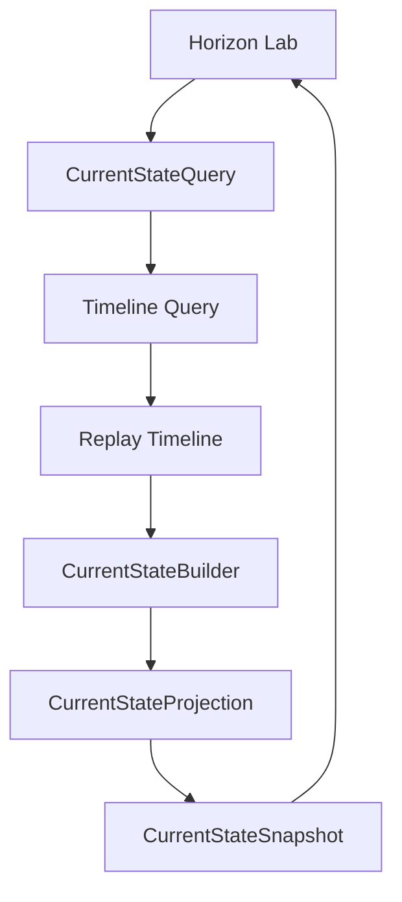

# RFC-0007: Current State Engine

Status: Accepted

## Summary

Introduce the in-memory Current State Engine as the official present-state projection for an Asset.

The engine answers "How is this Asset now?" by reading Timeline entries and replaying Observations. It does not implement the Living Digital Twin, Knowledge, AI, recommendations, Collector behavior, physical persistence, APIs, or infrastructure.

## Context

Sprint-008 introduced Timeline as Horizon's chronological memory. Consumers now need a deterministic present-state projection that summarizes the latest known value for each Observation type without mutating Timeline or reading raw events directly.

## Goals

- Build Current State from Timeline entries.
- Keep the latest known value by Observation type.
- Preserve deterministic ordering semantics.
- Return an immutable snapshot.
- Expose an in-memory application query and Horizon Lab flow.

## Non-Goals

- Implement Living Digital Twin behavior.
- Implement Knowledge Engine, Insights, Recommendations, Health Score, AI, or inference.
- Implement Collector behavior, telemetry ingestion, API, FastAPI, database, ORM, Docker, Redis, or physical persistence.
- Mutate Timeline entries.
- Read directly from Event Envelopes or Domain Events.

## Domain Language

- `CurrentState`: present-state projection for one Asset.
- `CurrentStateBuilder`: builds state by replaying Timeline entries.
- `CurrentStateProjection`: latest known values grouped by Observation type.
- `CurrentStateSnapshot`: immutable serializable state result.
- `CurrentStateQuery`: request for the current state of one Asset.
- `CurrentStateService`: application-facing orchestration service.

## Flow

## Compatibility

Current State depends on Timeline semantics. Future persistence or Event Store work must preserve deterministic replay order and immutable snapshot behavior.
