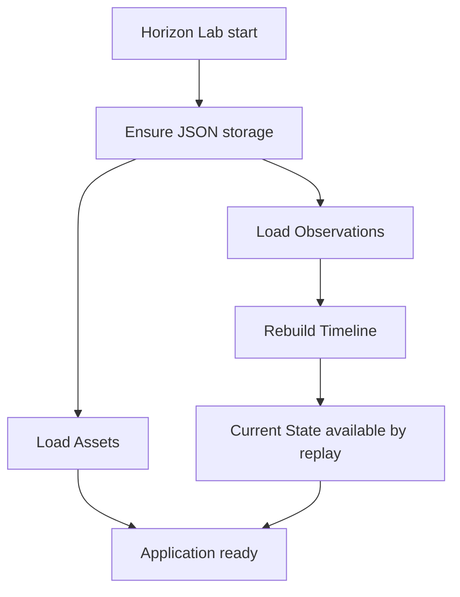

# RFC-0008: Persistence Layer

Status: Accepted

## Summary

Introduce the first official Horizon persistence adapter as readable JSON storage for persisted facts.

This RFC does not approve databases, ORM tools, external infrastructure, Event Store behavior, API persistence, or Digital Twin persistence.

## Context

Horizon can register Assets, record Observations, build Timeline memory, and derive Current State in memory. Restarting Horizon Lab currently loses facts, which prevents repeated local validation across sessions.

The Engineering Playbook and accepted ADRs state that domain truth must remain independent from infrastructure. This persistence layer therefore stores only source facts and rebuilds derived projections on startup.

## Goals

- Persist Assets as JSON facts.
- Persist Observations as JSON facts.
- Auto-create local storage files on first execution.
- Rebuild Timeline from persisted Observations.
- Rebuild Current State from Timeline replay.
- Keep the domain package unaware of JSON and storage adapters.
- Keep JSON readable, indented, and versionable.

## Non-Goals

- Implement databases, SQLite, PostgreSQL, Redis, ORM tools, Docker, FastAPI, APIs, or infrastructure services.
- Persist Timeline, Current State, Replay results, Knowledge, Digital Twin behavior, Insights, or Recommendations.
- Implement Event Store semantics.
- Change Asset or Observation domain rules.

## Persisted Facts

Only these files are persisted:

```text
storage/assets.json
storage/observations.json
storage/metadata.json
```

Timeline and Current State are projections. They are rebuilt from `observations.json` at Horizon Lab startup.

## Bootstrap Flow



## Compatibility

`metadata.json` carries `storage_version`. Future storage evolution must add compatible readers before changing persisted shape.

JSON adapters may be replaced later by approved storage adapters without changing domain packages.
