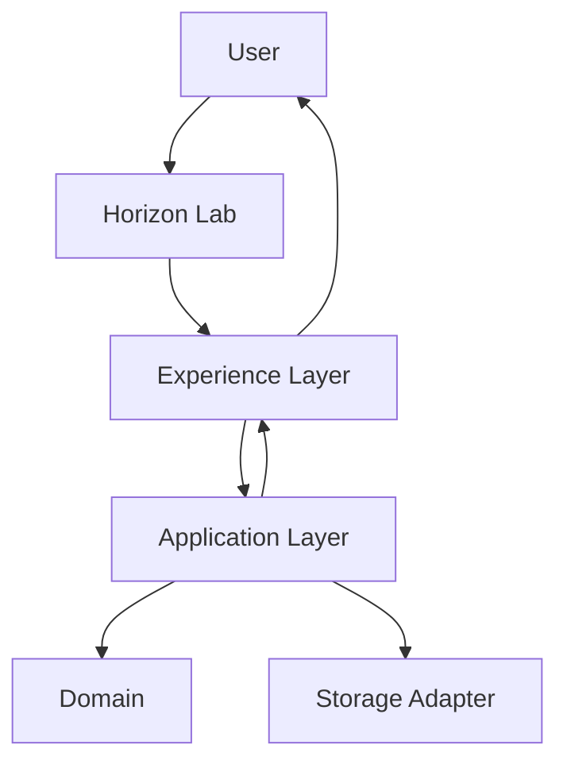

# RFC-0009: Experience Layer

Status: Accepted

## Summary

Introduce the Horizon Experience Layer as the user-facing translation layer for Horizon Lab.

The Experience Layer improves language, prompts, validation, success messages, errors, Timeline presentation, and Current State presentation without changing domain, application, storage, timeline, replay, event bus, protocol, or business rules.

## Goals

- Replace technical terminal language with user-oriented language.
- Prevent invalid user input from crashing Horizon Lab.
- Hide UUIDs, aggregates, domain events, event envelopes, trace, correlation, and metadata from normal users.
- Present Timeline and Current State in a readable form.
- Keep all existing technical behavior internal.

## Non-Goals

- Change domain behavior.
- Change application use cases.
- Change storage semantics.
- Change Timeline or Current State projections.
- Add Rich.
- Add Experience Profiles.
- Add Developer Mode.
- Implement Living Digital Twin, Knowledge, AI, Collector, API, or infrastructure behavior.

## Boundary

`horizon-experience` contains presentation helpers only. It must not depend on `horizon-domain` and must not implement business rules.

Horizon Lab may consume the Experience Layer to render output and validate terminal input before commands are sent to the Application Layer.

## Flow

## Compatibility

All existing domain and application contracts remain unchanged. The Experience Layer can evolve independently as long as it does not alter behavior or persist derived data.
