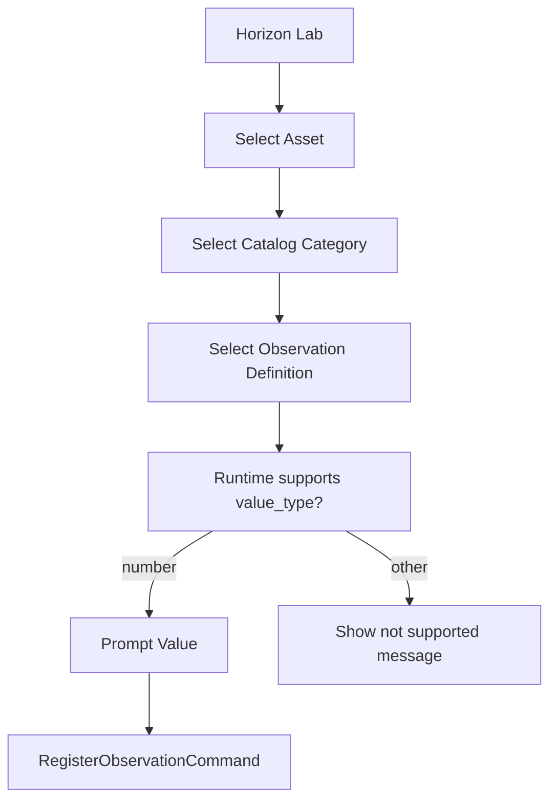

# RFC-0010: Observation Catalog

Status: Accepted

## Summary

Introduce `horizon-catalog` as the official reusable catalog for Observation definitions.

The catalog removes free typing of Observation types from user-facing flows while remaining independent from Domain, Application, Storage, Timeline, Current State, Event Bus, Protocol, Experience, API, Collector, Twin, and AI.

## Goals

- Define official Observation definitions.
- Support `number`, `text`, `boolean`, `enum`, and `datetime` value types.
- Provide lookup by ID and alias.
- Provide category-based navigation.
- Provide the first internal Vehicle profile.
- Allow future external catalog loading without introducing YAML in this sprint.

## Non-Goals

- Change `Observation.value`.
- Change Domain or Application contracts.
- Change Storage, Timeline, Current State, Replay, Event Bus, or Protocol.
- Implement API, Collector, Twin, AI, or external loaders.
- Encode enum/text/boolean/datetime into numeric values.

## Runtime Compatibility

The current Runtime can register only numeric Observation values. Horizon Lab therefore registers only catalog definitions whose `value_type` is `number`.

When users select another value type, Horizon Lab shows:

```text
🚧 Este tipo de observação já existe no Catálogo, mas ainda não é suportado pelo Runtime atual.
```

The future `Observation Value Model` capability will evolve the runtime model for non-numeric values.

## Vehicle Profile

The first profile includes:

- Motor
- Elétrica
- Combustível
- Transmissão
- Movimento
- Localização

## Flow


